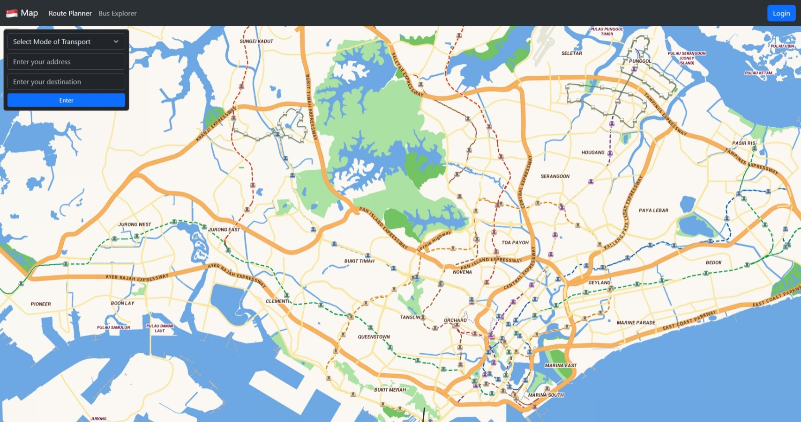

# Singapore Map :singapore:

## Description

Singapore Map is a web-based mapping application, similar to Google Maps and Waze, localised to Singapore. It is designed to simplify navigation with features such as routing via private and public transport, displaying realtime traffic information and providing users using private transport with nearby parking at their destination 

Our main learning objectives of the assignment was to:
- implement open source APIs
- utilise publicly available government data
- develop an innovative application

## Table of Contents

- [Getting Started](<#getting-started>)
- [Usage](#usage)
- [Credits](#credits)

## Getting Started
### Prerequisites
Python 3.12
```bash
python --version # check python version
```

### Installation

Clone the project
```bash
git clone https://github.com/jovantay521/sc3000-project.git
```

Create virtual environment
```bash
python -m venv .venv
```

Activate virtual environment
```bash
# bash/zsh
source .venv/bin/activate
```

```ps1
# powershell
source .venv/bin/Activate.ps1
```

Installing required packages
```bash
pip install -r requirements.txt
```

## Usage
Host website locally
```
python main.py
```

## Built Using
- [Flask](https://flask.palletsprojects.com/en/3.0.x/) - Web Framework
- [Firebase](https://firebase.google.com/) - Database

## Credits (to be updated)
- Tay Jovan
- Lee Bohui
- Yan Zhi Xiang
- Martin
- Bel